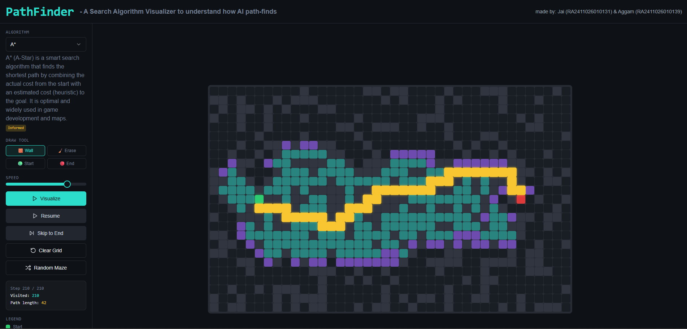

# Pathfinder: AI Search Algorithm Visualizer



## Project Overview

Pathfinder is a web-based application designed to visualize the execution of various AI pathfinding algorithms in real-time. It provides an interactive grid where users can observe how different search strategies explore a space to find the optimal path from a starting point to an end point. This tool is built to offer a clear and intuitive understanding of how these fundamental AI algorithms operate.

## Features

*   **Algorithm Visualization:** Watch algorithms as they explore the grid step-by-step.
*   **Interactive Grid:** Draw custom walls and obstacles directly on the grid.
*   **Adjustable Speed:** Control the speed of the visualization to watch at your own pace.
*   **Maze Generation:** Automatically generate a random maze for the algorithms to solve.
*   **Real-time Statistics:** View the number of visited nodes and the final path length.

### Implemented Algorithms

*   A* Search
*   Greedy Best-First Search
*   Uniform Cost Search (UCS)
*   Breadth-First Search (BFS)
*   Depth-First Search (DFS)

## Local Setup

To run this project on your local machine, follow these steps:

1.  **Clone the repository:**
    ```sh
    git clone <repository-url>
    cd <repository-directory>
    ```

2.  **Install dependencies:**
    ```sh
    npm install
    ```

3.  **Run the development server:**
    ```sh
    npm run dev
    ```

The application will be available at `http://localhost:5173`.

## Tech Stack

*   **Frontend:** React, Vite
*   **Styling:** Tailwind CSS
